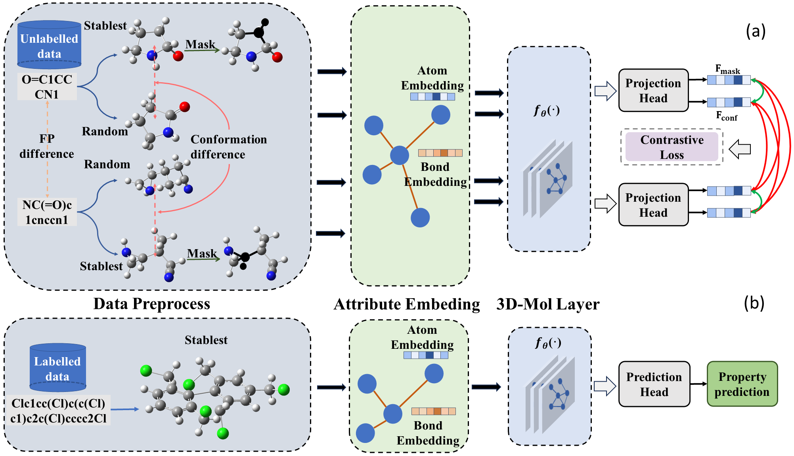

# 3D-Mol: A Novel Contrastive Learning Framework for Molecular Property Prediction with 3D Information

3D-Mol is an advanced molecular modeling method designed to fully harness the 3D spatial structure of molecules. By deconstructing molecules into three geometric graphs, 3D-Mol effectively extracts 3D features. This approach, combined with the use of contrastive learning from 20M unlabeled data, ensures superior performance in molecular property prediction tasks. The following are the commands for each step.

Figure: The overview of the 3D-Mol model framework.
    a) In the pretraining stage, we employ weighted contrastive learning to effectively pretrain our model. In addition to using the mask strategy for graph data augmentation, we consider conformations from the same SMILES as positive pairs, while the weight represents the conformational similarity. Conversely, distinct topological structures are treated as negative pairs, and we further utilize FP differences to compute the weight of negative pairs. Conversely, distinct topological structures are treated as negative pairs, and the weight is dependent on FP differences. 
    b) In the finetuning stage, we refine the well-pretrained encoder using diverse downstream datasets, followed by supervised learning.

## Install requirements

We use Paddle, RDKit, PGL and the others python package for our experiment, and you can install them by the following command. 

    pip install -r requirement.txt

## Data preprocess

Pretraining datasets are as follow, you need to download them and put them in ./pretrain_data folder.

- [ZINC20](https://zinc20.docking.org/): A subset of the ZINC database, offering over 230 million purchasable compounds in ready-to-dock, 3D formats for virtual screening.
- [PubChem](https://pubchem.ncbi.nlm.nih.gov/): A free database maintained by the NCBI that provides detailed information on the biological activities of small molecules.

Downstream dataset:  [MoleculeNet](https://moleculenet.org/)- stored in `downstream_datasets`, the following are the different dataset in finetune stage.

- bbbp
- bace
- tox21
- clintox
- sider
- toxcast

The code for preprocessing and spliting data are stored in ./utils folder, and the code for upload the cached data is stored in ./featurizers. You can preprocess pretraining data by following command, It may cost lots of time, better to process the data in parallel.

    bash scripts/data_preprocess.sh

## Pretrain stage

The code of pretraining model and strategy are stored in ./model_zoo folder, and the config of the model is stored in ./model_config folder. You can pretrain the random initialized model by following command, and the well-pretrained model will be stored in ./pretrain_model folder. 

    bash scripts/pretrain.sh

## Finetune stage

The code of finetune model are stored in ./src/model.py. You can finetune the well-pretrained model by following command, and the well-finetuned model will be stored in ./finetune_models folder, and the logs are stored in ./log/finetune folder.

    bash scripts/finetune.sh

## Noting

This code is base on GEM work, and the link is: https://github.com/PaddlePaddle/PaddleHelix/tree/dev/apps/pretrained_compound/ChemRL/GEM.
